# 포트폴리오
## 목차
1. Winui3  
1.1. 프로그램 개요  
1.2. 기술  

2. Arp Spoofing (Linux)  
2.1. 프로그램 개요  
2.2. 시나리오 1번  
2.3. 시나리오 2번  

3. 시청 네트워크 구성  
3.1. 프로젝트 소개  
3.2. 네트워크 구성
3.2. Packet tracer를 이용한 시뮬레이션  

4. DLL Hooking  
4.1. 프로그램 개요  
4.2. 기술

5. StealthProcess  
5.1. 프로그램 개요  
5.2. 기술  

## 1. Winui3

### 1.1. 프로그램 개요
<strong>개발 일자</strong> : 2023.04 ~ 2023.06  
<strong>OS</strong> : Window 10 ~ Window 11  
<strong>개발도구</strong> : Visual Studio 2022, Windows App SDK  
<strong>프로그램명</strong> : MDAQ  
<strong>사용 목적</strong> : DAQ 보드에서 오는 디지털, 아날로그 신호를 Window에서 받아 파싱 후, 얻은 데이터를 각 소프트웨어 네트워크 통신을 통해 전달  

### 1.2. 기술
#### <strong>1. 전체화면</strong>
<image src="./mdaq1.png" align="center" border="1" title="mdaq1">
  
MDAQ 프로그램에 전체 화면이다. 전체적으로 네비게이션 구조를 뛰고 있으며, 크게 <U><strong>보기, 설정</strong></U> 두 개의 탭으로 구성 하였다.  

#### <strong>2.1. 설정-연결</strong>  
<image src="./MdaqSetting1.png" align="center" border="1" title="Setting1">
  
Serial 통신을 할려면 Serial 포트 번호를 알아야 한다. Serial 포트 번호를 장치관리자에서 번호 확인 후 <U><strong>텍스트박스 입력 후 연결 버튼을 클릭하면 Seiral 통신이 연결</strong></U>된다.  

#### <strong>2.2. 설정-디지털</strong>  
<image src="./MdaqSetting2.png" align="center" border="1" title="Setting2">
  
DAQ 보드를 통해 들어오는 데이터 값은 약 50가지였다. 각 값에 표현을 <U><strong>GridView - Item 형식</strong></U>으로 50가지를 나열 하였다. 또한 들어온 DAQ 값을 1,0으로 파싱하기 위한 메커니즘을 담당한다. 값의 파싱 값이 1일 경우 이미지가 초록색 체크 표시로 변한다.

#### <strong>2.3. 설정-매핑</strong>  
<image src="./MdaqSetting3.png" align="center" border="1" title="Setting3">
  
하드웨어 - DAQ 보드 연결 간 정해진 규정이 없었기에, <U><strong>하드웨어 값 DAQ 매핑 간 소프트웨어 처리를 하기위해 각 데이터 값을 콤보 박스를 통해 매핑 하는 기능을 담당</strong></U>한다.  

#### <strong>2.4. 설정-아날로그</strong>  
<image src="./MdaqSetting4.png" align="center" border="1" title="Setting4">
  
아날로그 값은 약 10가지 정도 였었다. 각 값은  <U><strong>Grid - StackPanel구조를 채용 했고, 들어오는 값의 노이즈 값을 베이스로 하여 0 ~ 100으로 변환하는 알고리즘</strong></U>이 들어가 있다. 하단에는 Progress Bar를 이용하여, 수치별로 들어오는 데이터 값을 볼 수 있다.

#### <strong>2.4. 설정-저장,불러오기</strong>  
<image src="./MdaqSetting5.png" align="center" border="1" title="Setting5">
  
오른쪽 하단 패널에 저장, 불러오기 버튼을 이용하여, 세팅한 값을 .ini 형식 파일로 저장하며, 불러오기 기능이 있다.  

## 2. ARP Spoofing (Linux)

### 2.1. 프로그램 개요
<strong>개발 일자</strong> : 2023.12.6 ~ 2023.12.13  
<strong>OS</strong> : Fedora 38, Fedora 39  
<strong>개발도구</strong> : GCC Compiler  
<strong>프로그램명</strong> : ARPSpoofing  
<strong>사용 목적</strong> : 네트워크 보안 공격 기법 중 하나, 2계층 프로토콜인 ARP를 이용하여, 같은 네트워크 다른 사용자에 네트워크 통신 정보를 엿볼 수 있다.  
<strong>소스코드</strong> : https://github.com/yangbumki/arpspoofing  
<strong>시나리오</strong> : 
1. Linux 에서 ArpSpoofing을 통해 Windows10 네트워크 내용 가로채기
2. Linux 에서 ArpSpoofing을 통해 Galaxy Z Flip3 5G 네트워크 내용 가로채기

### 2.2. 시나리오 1번
#### 2.2.1 세팅
두 컴퓨터의 내부 네크워크 구성  

|컴퓨터|IP|  
|---|---|
|1번 컴퓨터| 192.168.32.16  
|1번 컴퓨터 가상 Linux|  192.168.32.100  
|2번 컴퓨터| 192.168.32.1  

##### 1번 컴퓨터 가상 Linux  
<image src="./ArpSpoofingSetting1.png" align="center" border="1" title="ArpSetting1">

##### 1번 컴퓨터 
<image src="./ArpSpoofingSetting2.png" align="center" border="1" title="ArpSetting2">

##### 2번 컴퓨터 
<image src="./ArpSpoofingSetting3.png" align="center" border="1" title="ArpSetting3">

#### 2.2.2. 시나리오 시작
<image src="./ArpSpoofing1.png" align="center" border="1" title="ArpSpoofing1">
  

|항목|내용|
|---|---|
|Interace|내부 네트워크 인터페이스 이름|
|Source IP|스푸핑 대상의 대상 아이피(게이트웨이 등)|
|Destination IP|스푸핑 대상의 아이피|

자신의 Mac Address 는 인터페이스 이름을 통하여 구하고 상대방에 Mac Address 주소는 대상 IP와 ARP 테이블을 통하여 구하는 방식이다. (현재는 보안상의 이유로 브로드케스트를 채용하고 있다)  
네트워크 소켓은 2계층 레이어까지 건들 수 있는 Packet Socket을 채용했다.(Window xp 이상 OS는 보안상의 이유로 3계층 레이어 소켓 중 하나인 RawSocket 부터 막아났다)

<image src="./ArpSpoofing3.png" align="center" border="1" title="ArpSpoofing3">
  

대상 네트워크 cmd를 통하여, Ping 요청을 보낸다. Arp Spoofing 현재 네트워크 과부화를 고려하여 텀을두고 보내기에, 중간에 원래 ARP Reply로 인하여, ICMP 도달 성공하는 경우가 있다. 또한 받은 스푸핑한 네트워크 패킷을 다시 라우팅 시키는 코드를 넣지 않았기에 '요청 시간이 만료되었습니다.'가 나온다.  

<image src="./ArpSpoofing2.png" align="center" border="1" title="ArpSpoofing2">
  

Linux - WireShark를 통하여 ICMP 정보가 들어오는 것을 확인한다.

### 2.3 시나리오 2번
#### 2.3.1. 세팅
|컴퓨터|IP|
|---|---|
|ARP Spoofing 컴퓨터|192.168.1.176/24|
|갤럭시 플립3|192.168.1.122/24|

##### Linux
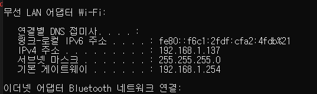

##### 갤럭시 플립 3
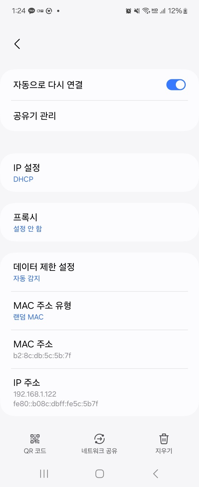

#### 2.3.2. 시나리오 시작

##### 네트워크 인터페이스 확인 (enp0s8)
  

##### WireShark 실행
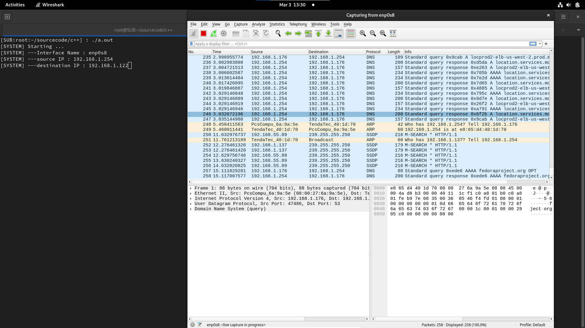

##### arpSpoofing 실행
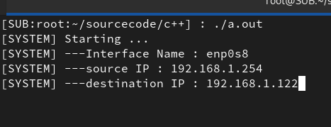

##### 결과
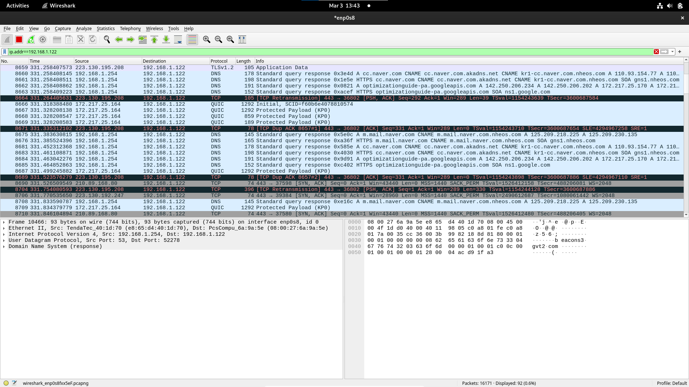

플립3 192.168.1.122 -> 게이트웨이 192.168.1.254 요청한 패킷들이 Linux에서 켠 WireShark 에서 포착된다.

## 3. 시청 네트워크 구성
### 3.1. 프로젝트 소개  
|||
|---|---|
|프로젝트명|서울특별시청 서대문 청사 네트워크 구축|
|기간|2023.11.20 ~ 2023.11.23|
|목적|초고속 정보통신 네트워크 고도화 장비 구축 및 서버 개설|

<image src="./Network.png" align="center" border="1" title="Network1">
  

<strong>사업 목적</strong> : 서울시청 서소문청사 1Gbps 급 광대역화 네트워크 구성 및 각 부서별 워크그룹 스위치간을 광케이블 구성하여 통신구간의 병목현상의 해소와, 대역폭을 넓혀 각 네트워크에 각종 응용프로그램을 원할히 사용할 수 있는 환경 조성 및 정보 공유의 가속화 및 신속한 의사결정 및 외부 사용자에게 DNS, Web 서비스를 제공할 수 있도록 서버 구축으로 양질의 행정서비스 제공과 내부 Intranet, PFT 서버 구성으로 사내 정보 통신 환경 구성, 또한 DHCP 서버 구성으로 PC 추가 시 자동 IP 구성으로 가용성을 높여 효율적인 내부 업무처리로 양질의 대민 행정 서비스 제공  

<strong>사업 내용</strong>	: IPS 업체 제공 라우터 2대 이용하여 외부 WAN 접속을 위한 Gateway, FireWall 환경 구성 Gbps 이상의 백본 스위치 LAN/WAN 통신 으로 Work-group 간의 네트워크 통신 및 외부 네트워크(인터넷망)에 원할한 접속 부용 서버 (Web, DNS)를 Windows 기반 구축하여 Web 외부 네트워크에서 DNS 서비스를 이용한 Web 접속, 내부용 서버 (Interanet, Mail, DHCP)를 Windows 기반 구축하여 내부 Intranet, Mail 기능을 활용하여 Work-Group 간 통신 구성 및 고가용성 확보

### 3.2. 네트워크 구성

<image src="./Network2.png" align="center" border="1" title="Network2">
  

### 3.3. Packet tracer를 이용한 시뮬레이션 

#### 전체 구성
<image src="./Network4.png" align="center" border="1" title="Network4">
  

#### 동별 구성
<image src="./Network3.png" align="center" border="1" title="Network3">
  

## 4. DLL Hooking
### 4.1. 프로그램 개요
* <strong>개발 일자</strong> : 2024.02.21 ~ 2024.02.22
* <strong>OS</strong> : Window 10
* <strong>개발도구</strong> : Visual Studio 2022
* <strong>프로그램명</strong> : NotepadIATHooking 
* <strong>사용 목적</strong> : 특정 프로그램에 Import Address Table DLL 후킹을 통하여, 사용되는 내장 함수를 변경한다.
<strong>소스코드</strong> : https://github.com/yangbumki/NotepadIATHooking

### 4.2. 기술
#### DLL Injector
* DLLinjector.exe : 특정 프로그램의 제작한 DLL을 넣기 위해, 사용한다.

#### IAT Hooking DLL
* IATHooking.dll : IAT 후킹 코드가 들어간 DLL (SetWindowTextW를 후킹할 것 이다.)

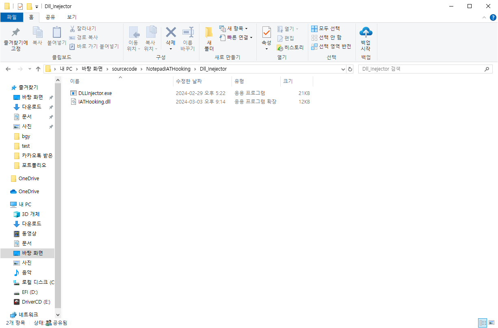

#### notepad.exe
* DLL 후킹 검증을 위해, window 기본 설치 프로그램, notepad.exe

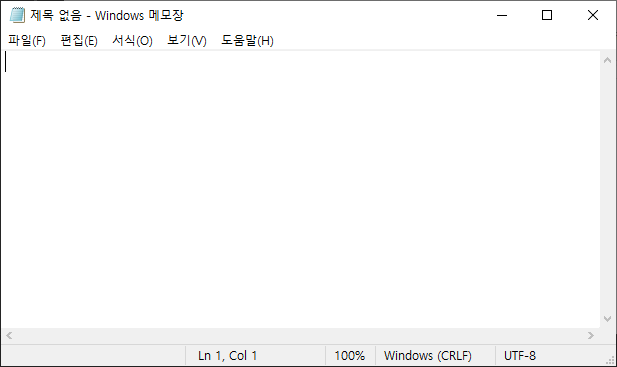

#### DLL 후킹 시작
notepad.exe 제목은 user32.dll - SetWindowTextW 함수를 사용하여, 제목을 생성한다.  
내부 내용 변경 시 제목이 변경 되므로, 이때 IAT 내부 함수 위치를 IATHooking.dll   
내부함수로 연결시켜 변경된 제목이 <strong>BGY</strong>가 되도록 DLL을 제작하였다.

* DLL 이름 입력  
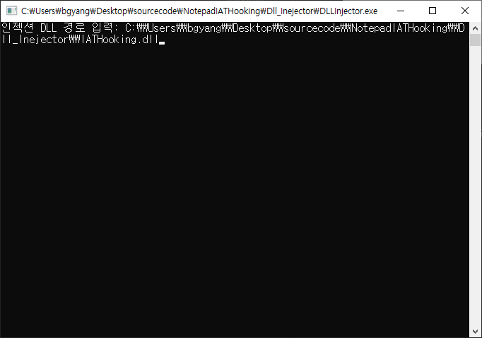

* exe 이름으로 프로세스 찾아 인젝션  
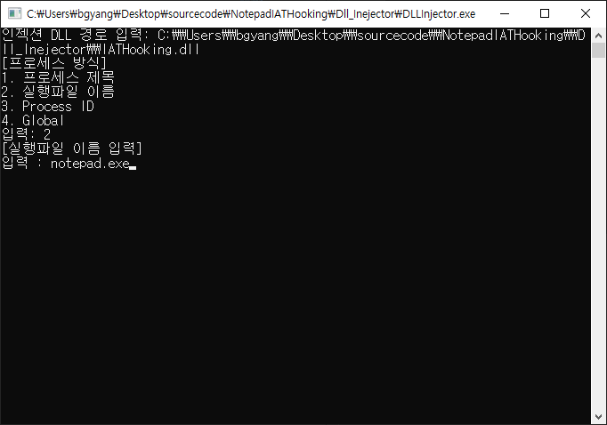

* DLL 인젝션 확인  
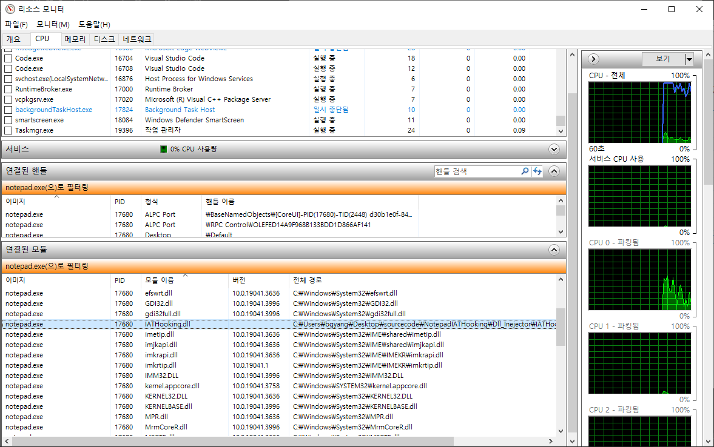

* 기본 notepad.exe  
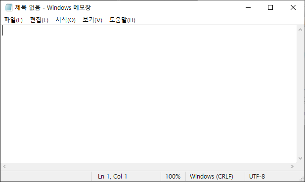

* notepad.exe 내부 내용 입력 시 원래 변경됬어야 될 제목 출력  
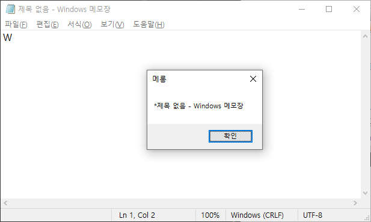

* 제목 변경 확인  
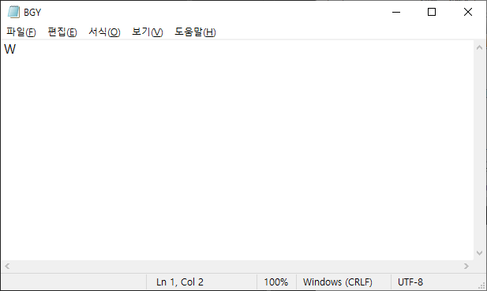

## 5. StealthProcess
### 5.1. 프로그램 개요
* <strong>개발 일자</strong> : 2024.02.23 ~ 2024.02.25
* <strong>OS</strong> : Window 10
* <strong>개발도구</strong> : Visual Studio 2022
* <strong>프로그램명</strong> : StealthProcess
* <strong>사용 목적</strong> : NtQuerySystemInformation 리스트에서 특정 프로세스를 뺴서 리스트를 참조하는 작업관리자, Procexp64.exe 프로그램에서 숨긴다.
<strong>소스코드</strong> : https://github.com/yangbumki/StealthPrcoess

### 5.2. 기술
#### DLL Injector
* DLLinjector.exe : StealthProcess.dll 을 인젝션 시킬 도구
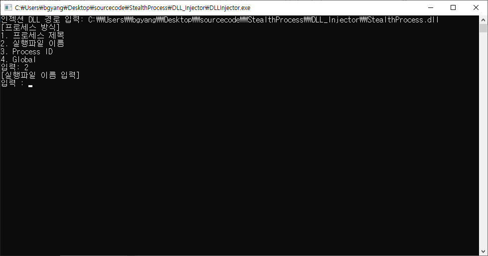

#### StealthProcess.dll
* StealthProcess.dll : NtQuerySystemInformation 함수 후킹을 위한 dll(전역 후킹, 공용 메모리를 사용하여 같은 이름에 모든 exe 파일을 감춘다.)
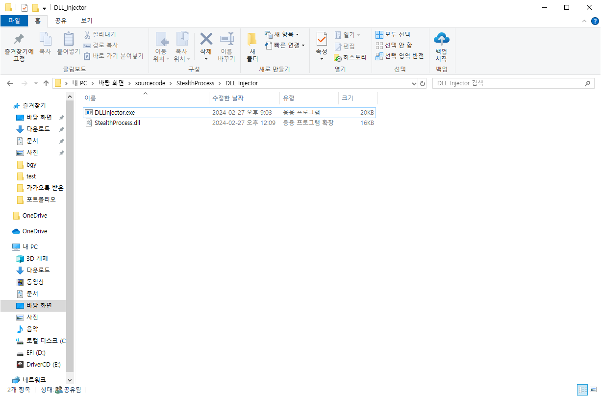

#### DLL Injection 시작
* DLL 경로 입력 후 특정 process 또는 전역 DLL 후킹을 선택 (관리자 권한으로 실행해야함 권한문제)
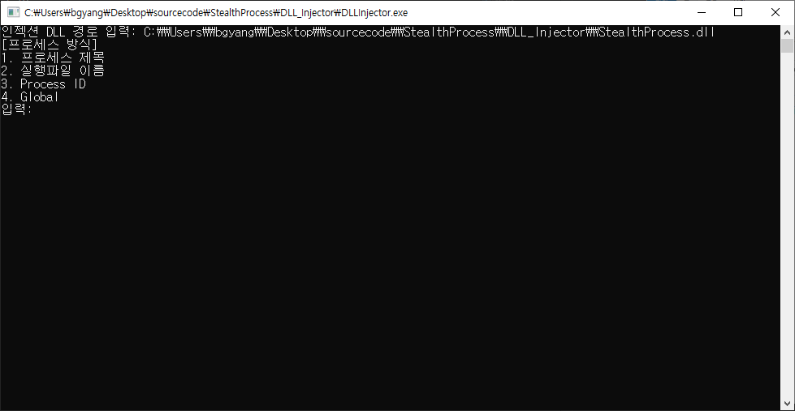

* Procexp64.exe 에서 notepad.exe 확인
    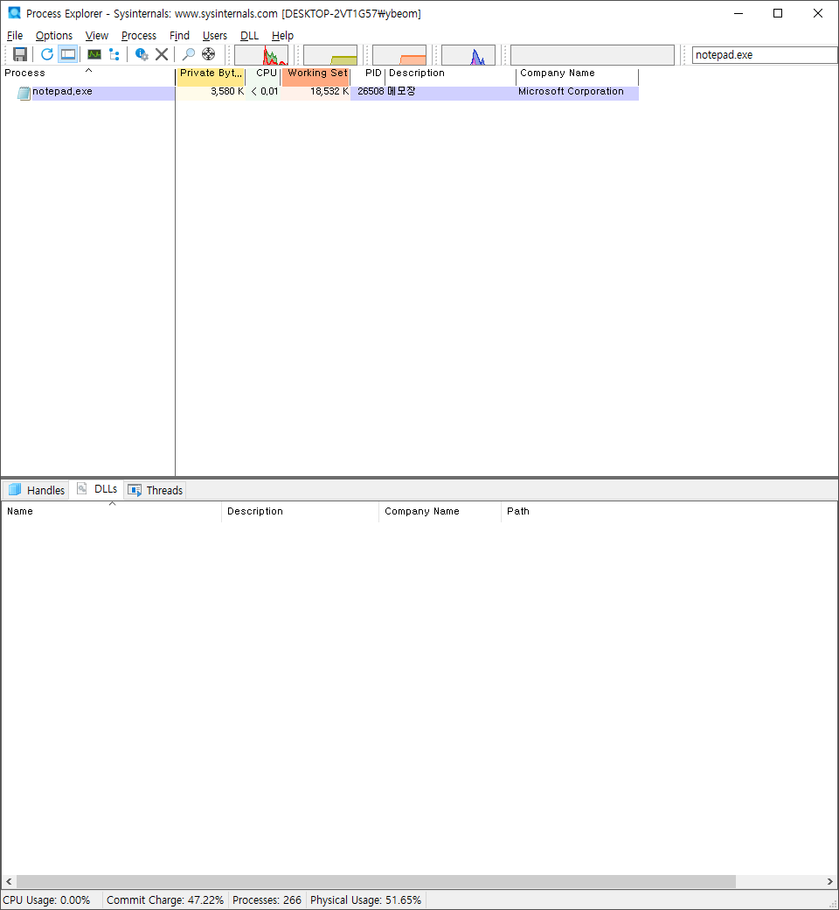

    * dll 인젝션 후 notepad.exe 확인
        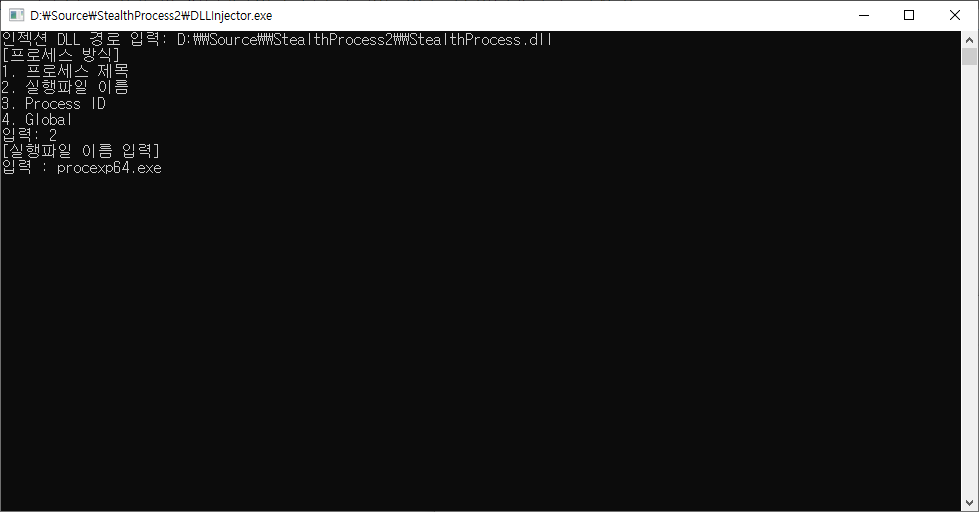
        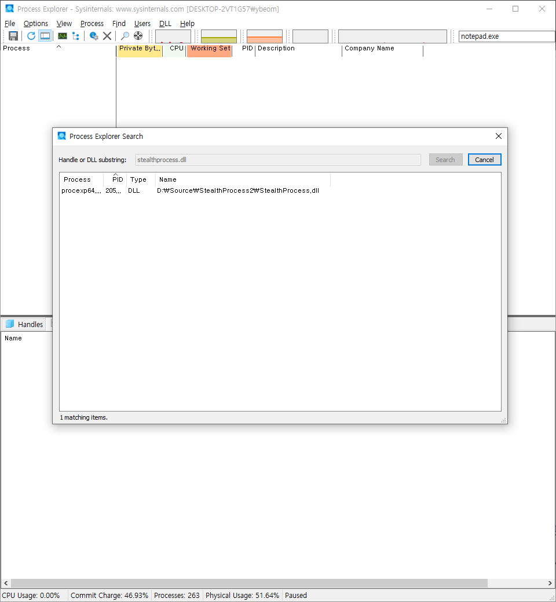

* 작업관리자에서 notepad.exe 확인
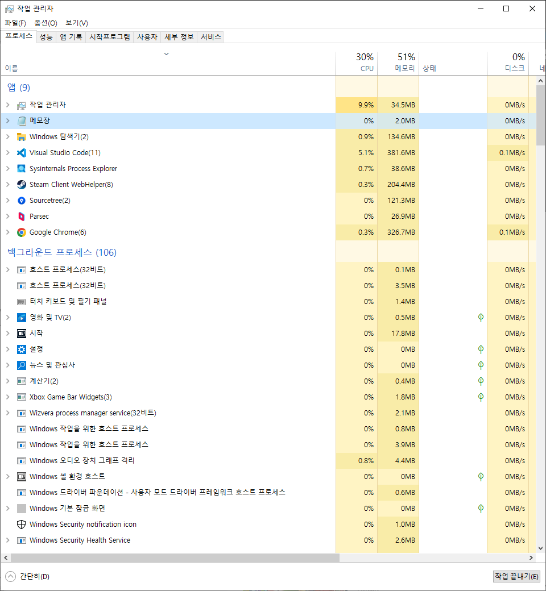

    * 작업관리자 dll 인젝션 후 notepad.exe 확인
        
        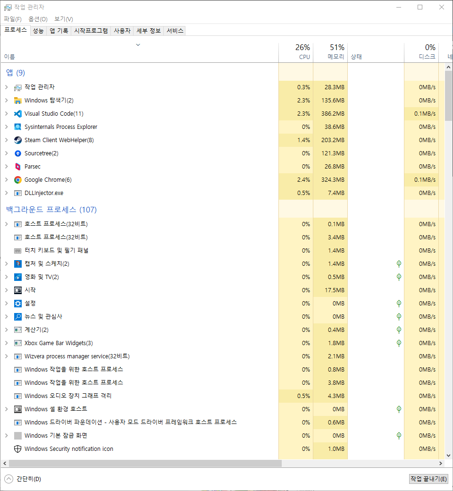